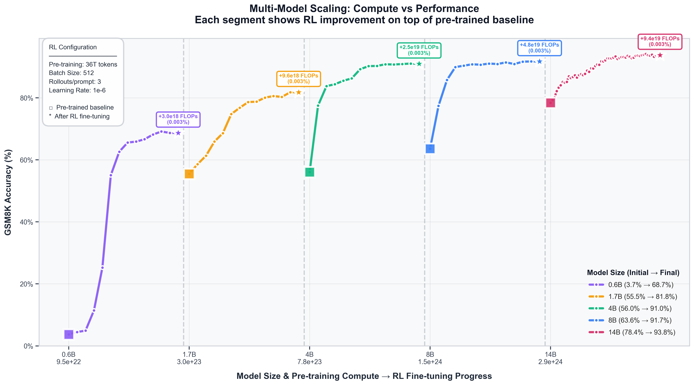

# RL Scaling Laws for Mathematical Reasoning

## Key Finding: Compute vs Performance

**RL provides significant gains on top of pre-trained models, with larger relative improvements on smaller models.**



This plot shows how GSM8K accuracy scales with total compute (pre-training + RL fine-tuning) across model sizes from 0.6B to 14B parameters. Each colored segment represents a model:
- **Square markers**: Pre-trained baseline performance
- **Star markers**: Performance after RL fine-tuning
- **Compute labels**: Total FLOPs invested (pre-training dominates, RL adds ~0.003%)

**Key insight:** Small models (0.6B-1.7B) see 25-28% absolute accuracy gains from minimal RL compute, while larger models (8B-14B) see 6-8% gains. This suggests different optimal compute allocation strategies depending on model size.

## Research Question

**Given N FLOPs, how should compute be split between pre-training and RL to maximize performance?**

Most scaling law work focuses on pre-training only. This project explores the compute-performance trade-offs when adding RL fine-tuning to pre-trained models.

## Experimental Setup

**Models:** Qwen3-base (0.6B, 1.7B, 4B, 8B, 14B) trained on 36T tokens  
**RL Algorithm:** GRPO with batch size 512, 3 rollouts/prompt, learning rate 1e-6  
**Configuration:** 36T pre-training tokens, 512 token context, ~56 RL training steps

### Evaluation Methods

Three reward functions tested:
1. **`strict`**: Requires exact `#### number` format
2. **`flexible`**: Extracts last number from response
3. **`custom_flexible`**: Stops at `####` marker, then extracts number

**Critical finding:** Base models fail at instruction following, not reasoning. Using `strict` rewards wastes RL compute teaching formatting instead of improving math ability.

## Results

### RL Scaling Laws

**GSM8K gains by model size (0-shot, custom_flexible):**

| Model | Baseline | After RL | Gain   | MATH Baseline | MATH After RL | MATH Gain |
| ----- | -------- | -------- | ------ | ------------- | ------------- | --------- |
| 0.6B  | 40.7%    | 68.3%    | +27.6% | 25.3%         | 33.8%         | +8.5%     |
| 1.7B  | 54.8%    | 80.4%    | +25.6% | 33.8%         | 41.3%         | +7.5%     |
| 4B    | 80.4%    | 88.5%    | +8.1%  | 41.0%         | 44.7%         | +3.7%     |
| 8B    | 81.5%    | 89.8%    | +8.3%  | 44.6%         | 46.9%         | +2.3%     |
| 14B   | 86.3%    | 92.6%    | +6.3%  | -             | 47.9%         | -         |

**Power law fit:** `Gain ≈ 10.7 × (Model_Size)^0.194`

Smaller models see larger relative gains from RL, with gains diminishing as base model quality increases.


### Cross-Domain Transfer

**GSM8K → MATH:** Limited but measurable transfer (0.6B: +8.5%, 14B: minimal)  
**GSM8K → MMLU:** No meaningful transfer to knowledge-based tasks


## Key Insights

1. **RL provides diminishing returns** as base model quality increases (power law exponent ~0.19)
2. **Smaller models benefit more from RL** proportionally (0.6B: +27.6% vs 14B: +6.3%)
3. **Evaluation method critically matters** - strict rewards waste compute on formatting, not reasoning
4. **Limited cross-domain transfer** - GSM8K → MATH shows gains, GSM8K → MMLU shows none
5. **Few-shot instruction collapse** - base models fail dramatically at 1-2 shots (4B: 67% → 1%)

### Limitations
- 512 token context clips ~7% of GSM8K problems
- Only 56 RL steps tested (plateau effects not fully characterized)
- No pass@k evaluation (greedy decoding only)

## Future Work

1. **Longer RL training** - characterize full sample efficiency and plateau effects
2. **32B model validation** - test if power law holds at larger scale
3. **Reverse transfer** - train on MATH, evaluate on GSM8K
4. **Optimal compute allocation** - find best pre-train/RL split for fixed FLOP budget
5. **Pass@k evaluation** - test if RL improves diversity or just mode collapse

## Usage

**Train:**
```bash
./train.sh 4B 1e-6 512  # model_size, lr, batch_size
```

**Evaluate:**
```bash
python -m eval.run --model Qwen/Qwen3-4B-base --shots 0,1,2,3,4,5
```

## Key Takeaway

**Measure the right thing.** Training RL on metrics that confound reasoning and formatting wastes compute. Custom flexible rewards achieve 2% better generalization to MATH compared to strict rewards, despite similar GSM8K scores.

---

*Models: Qwen3-base | Framework: GRPO via Verl | Compute: 36T pre-training tokens + ~56 RL steps*