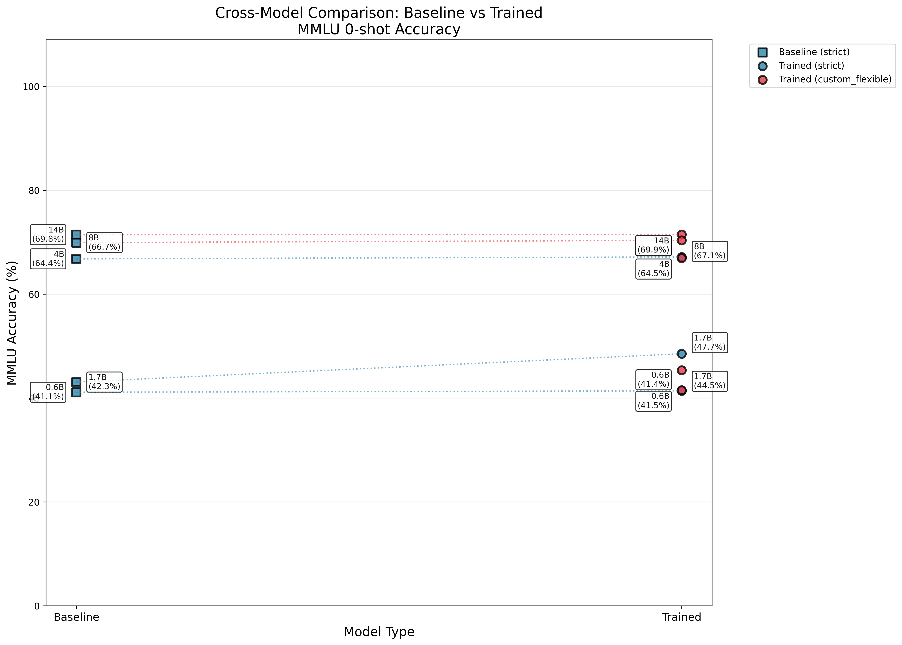

# RL Scaling Laws for Mathematical Reasoning

Investigating power laws for RL training on mathematical reasoning benchmarks using Qwen3 models (0.6B–14B parameters).

## Research Question

**Given N FLOPs, how should compute be split between pre-training and RL to maximize benchmark performance?**

Most scaling law work focuses on pre-training only. This project explores: up to what point should you pre-train, then do RL, to achieve certain quality.

Expected result: A power law equation `Accuracy = f(C_pretrain, C_rl)` relating base compute and RL compute to benchmark performance.

## Experimental Setup

### Models
- **Family:** Qwen3-base (0.6B, 1.7B, 4B, 8B, 14B)
- **Pre-training:** 36T tokens (30T normal + 5T reasoning focus + 1T long context)
- **Sizes tested:** Non-embedding parameters: 0.44B, 1.4B, 3.6B, 6.95B, 13.2B

### Training Configuration
- **Algorithm:** GRPO (Group Relative Policy Optimization)
- **Batch size:** 512
- **Epochs:** 2-4 (depending on model size)
- **Rollouts per prompt:** 3
- **Learning rate:** 1e-6
- **Precision:** BF16 with gradient checkpointing
- **Context limits:** 512 prompt + 512 response tokens
- **KL penalty:** 0.001 coefficient, low-variance estimator

### Evaluation Methods

Three reward functions tested for GSM8K:

1. **`strict`**: Requires exact `#### number` format (tests instruction following + reasoning)
2. **`flexible`**: Extracts last valid number from response (tests reasoning only)
3. **`custom_flexible`**: Stops at `####` marker, then extracts number (balances both)

Key finding: Base models fail at instruction following, not reasoning. Using `strict` rewards wastes RL compute on formatting instead of math improvement.

## Key Results

### 1. Evaluation Method Impact

**0.6B Model GSM8K (0-shot):**
| Method          | Baseline | After RL | Gain   |
| --------------- | -------- | -------- | ------ |
| Strict          | 0.0%     | 69.1%    | +69.1% |
| Flexible        | 40.7%    | 68.3%    | +27.6% |
| Custom Flexible | 40.7%    | 68.3%    | +27.6% |

**Critical insight:** Strict evaluation shows 0% baseline because the model can do math (40% flexible) but doesn't follow format. RL on strict teaches formatting, not reasoning.

### 2. Few-Shot Performance Patterns

Base models show **severe instruction collapse** at 1-2 shots in strict mode:
- **4B baseline:** 67.4% (0-shot) → 1.2% (1-shot) → 0.8% (2-shot)
- Pattern: Model generates solutions but continues creating new problems instead of stopping

**Custom flexible** evaluation removes this artifact by truncating at first `####` marker.


### 3. RL Scaling Laws

**GSM8K gains by model size (0-shot, custom_flexible):**

| Model | Baseline | After RL | Gain   | MATH Baseline | MATH After RL | MATH Gain |
| ----- | -------- | -------- | ------ | ------------- | ------------- | --------- |
| 0.6B  | 40.7%    | 68.3%    | +27.6% | 25.3%         | 33.8%         | +8.5%     |
| 1.7B  | 54.8%    | 80.4%    | +25.6% | 33.8%         | 41.3%         | +7.5%     |
| 4B    | 80.4%    | 88.5%    | +8.1%  | 41.0%         | 44.7%         | +3.7%     |
| 8B    | 81.5%    | 89.8%    | +8.3%  | 44.6%         | 46.9%         | +2.3%     |
| 14B   | 86.3%    | 92.6%    | +6.3%  | -             | 47.9%         | -         |

**Power law fit:** `Gain ≈ 10.7 × (Model_Size)^0.194`


Observations:
- Smaller models see larger relative gains from RL
- Gains diminish as base model quality increases
- Cross-domain transfer to MATH exists but is limited


### 4. Cross-Domain Transfer

**MMLU performance (0-shot):**
- **0.6B:** 41.1% → 41.5% (no change)
- **1.7B flexible:** 42.3% → 44.5% (+2.2%)
- **1.7B strict:** 42.3% → 47.7% (+5.4%)
- **4B:** 64.4% → 64.5% (no change)
- **8B:** 66.7% → 67.1% (no change)

**Finding:** RL on GSM8K provides minimal MMLU transfer, except when teaching formatting (strict mode). No domain generalization to knowledge-based tasks.




### 5. Reward Function Comparison

**0.6B trained for ~56 steps:**
- **Strict (72 steps):** 69.1% GSM8K, 31.6% MATH
- **Custom flexible (56 steps):** 68.3% GSM8K, 33.8% MATH
- **Flexible + format bonus (56 steps):** 68.2% GSM8K, 33.8% MATH

**Key finding:** Custom flexible achieves **better generalization to MATH** (+2.2% absolute) with fewer steps, confirming that strict mode wastes compute on formatting.


### 6. Validation Loss Scaling

Validation loss on WikiText-2 follows standard pre-training scaling:
- 0.6B: loss=2.69, perplexity=14.8
- 1.7B: loss=2.38, perplexity=10.9
- 4B: loss=2.20, perplexity=9.0
- 8B: loss=2.08, perplexity=8.0
- 14B: loss=1.98, perplexity=7.3


## Interesting Findings

### ✅ Confirmed Hypotheses
1. **RL provides diminishing returns** as base model quality increases (power law with exponent ~0.19)
2. **Smaller models benefit more from RL** proportionally (0.6B: +68% vs 14B: +6.3%)
3. **Evaluation method critically matters** - wrong metrics lead to wrong conclusions
4. **RL generalizes within math domain** - GSM8K → MATH transfer exists
5. **Instruction following ≠ reasoning** - base models can reason but fail at formatting

### ⚠️ Caveats & Limitations
1. **Context window limitation:** 512 token prompt clips ~7% of GSM8K problems
2. **No 32B model tested** - scaling law extrapolation predicts +5.7% gain but unverified
3. **Limited RL budget** - only 56 steps tested, plateau effects not fully characterized
4. **Single dataset family** - GSM8K only, no logic/general reasoning datasets
5. **Weight tying in small models:** 0.6B and 1.7B use weight tying (shared embeddings), may affect results
6. **No pass@k evaluation** - all results are greedy decoding (temperature=0)

### 🔍 Surprising Discoveries
1. **Few-shot hurts base models:** 4B drops from 67% → 1% accuracy with 1-shot prompting (instruction collapse)
2. **Entropy collapse is rapid:** Models plateau within 30-50 steps across all sizes
3. **MATH improves from GSM8K RL:** Despite different difficulty, 0.6B gains +8.5% on MATH from GSM8K training
4. **Format-focused RL hurts generalization:** Strict reward achieves same GSM8K but 2% worse MATH

## Future Work

### High Priority
1. **Compute scaling curves:** Train for 2-3x longer to characterize full RL sample efficiency
2. **32B model validation:** Test if power law extrapolation holds at larger scale
3. **Dataset ablations:**
   - Train RL on MATH → evaluate GSM8K (reverse transfer)
   - Test on pure logic benchmarks (ARC, etc.)
4. **Pass@k evaluation:** Does RL improve diversity or just mode collapse?

### Medium Priority
1. **Multi-shot robustness:** Why do base models collapse at 1-2 shots? Can RL fix this?
2. **Longer context:** Remove 512 token limit, test full GSM8K distribution
3. **KL coefficient sweep:** Current 0.001 - explore 0.0001 to 0.01 range
4. **Learning rate ablation:** Compare 1e-5 vs 1e-6 (noted as similar shape)

### Research Questions
1. **Optimal compute allocation:** Given fixed FLOP budget, what's the optimal pre-train/RL split?
2. **Cold start necessity:** Qwen3 did reasoning-focused pre-training - how much of RL gains depend on this?
3. **Dataset mixing:** Would GSM8K + MATH joint RL training improve both more than sequential?
4. **Format teaching:** Should formatting be taught in SFT before RL, or is RL acceptable?

## Additional Plots & Visualizations

All results are visualized above. Additional per-model plots available in `results/`:

- `{size}_gsm8k_accuracy_vs_shots.png` - Few-shot performance for each model
- `{size}_math_by_subject.png` - MATH subject breakdown for each model
- `{size}_mmlu_comparison.png` - MMLU comparison for each model
- `scaling_laws/flexible_custom/gsm8k_scaling_law.png` - Alternative scaling law fits
- `scaling_laws/val_losses_loss_flops.png` - Compute efficiency curves

## Repository Structure

```
├── analysis/           # Plotting and analysis scripts
├── eval/              # Benchmark evaluation code
│   ├── gsm8k.py
│   ├── math.py
│   ├── mmlu.py
│   └── val_loss.py
├── results/           # Experimental results (JSON + plots)
├── scripts/           # Utility scripts (HF uploads)
├── utils/             # Custom reward functions
│   └── custom_gsm8k_reward.py
├── train.sh           # GRPO training script
└── pyproject.toml     # Dependencies
```

## Running Experiments

**Train model:**
```bash
./train.sh 4B 1e-6 512  # model_size, lr, batch_size
```

**Evaluate:**
```bash
python -m eval.run --model Qwen/Qwen3-4B-base --shots 0,1,2,3,4,5
```

## Citations

- **Qwen3:** 36T token pre-training with reasoning focus (30T + 5T + 1T)
- **GRPO:** Off-policy RL with group-relative advantages
- **Verl:** Framework for efficient RL training (github.com/volcengine/verl)

## Key Takeaway

**Don't train RL on metrics that confound reasoning and formatting.** The difference between custom_flexible and strict rewards represents ~2% absolute performance on true reasoning generalization (MATH), despite similar GSM8K scores.

When building LLMs, measuring the right thing matters more than the optimization algorithm.